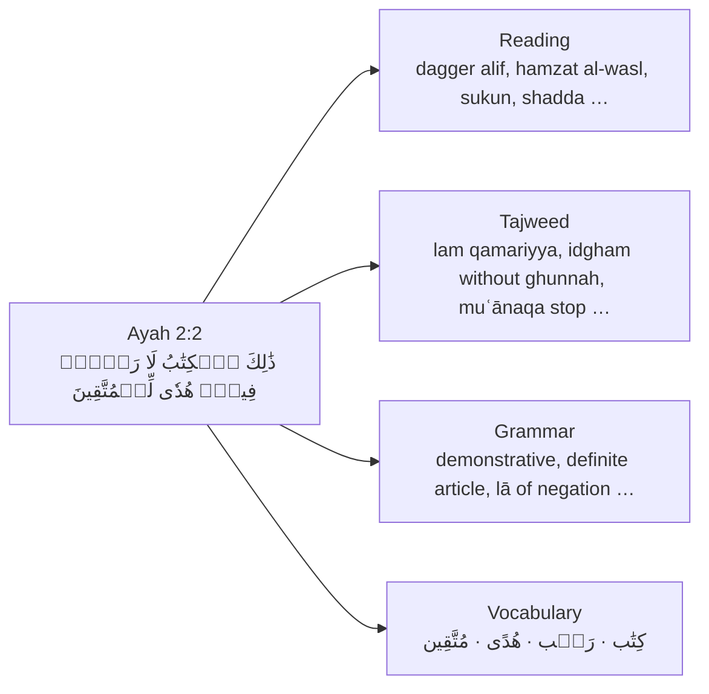
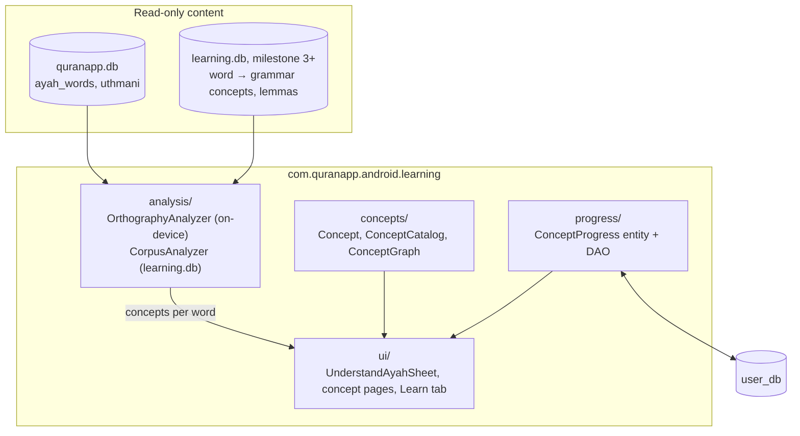
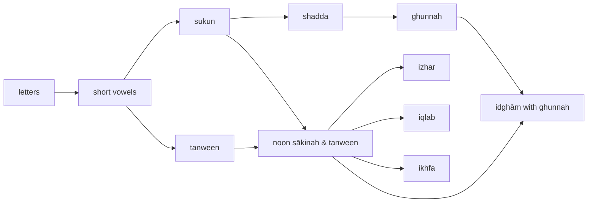

# Learning mode: design

> Status: proposal · Author: ae-dev-2025 · Last updated: 2026-09-26

This document explains how QuranApp can grow from a Quran *reader* into a place where
someone who cannot read Arabic yet can go from zero to understanding the Quran directly.
It covers the idea, the research behind it, what already exists in the codebase, the data
we can use, the architecture, and the order in which we will build it (as small PRs).

---

## 1. The idea in one picture

Open any ayah and ask: **"What do I need to know to fully read and understand this?"**

Each of those items is a **concept**. Concepts depend on other concepts (you can't learn
*idgham* before *sukun* and *shadda*), so together they form a **prerequisite graph**.
Given what a learner already knows, the app can then answer three questions:

1. **"What does this ayah need?"** Collect the concepts that occur in the ayah, add
   all their prerequisites, and remove what the learner already knows.
2. **"What should I learn next?"** The concepts whose prerequisites are all known, which
   knowledge-space theory calls the *outer fringe*.
3. **"Which ayahs can I read/understand right now?"** The ayahs whose concepts are (almost)
   all known.

"Zero to hero" is simply walking that graph, with the Quran itself as the reading material
from day one.

---

## 2. Why this approach (learning research)

| Principle | What it says | How we use it |
|---|---|---|
| **Prerequisite graphs / mastery learning** (Bloom; knowledge-space theory as used by ALEKS) | Learners progress best when new material only depends on material they have mastered. | Concepts form a DAG; "learn next" = concepts whose prerequisites are known. |
| **Lexical coverage** (Laufer 1989; Hu & Nation 2000) | ~95% known words gives minimal comprehension; ~98% is needed for comfortable, unassisted reading. | Per-ayah "comprehension %" from known vocabulary; recommend ayahs at the edge of the learner's ability (≈95–98%). |
| **Frequency-first vocabulary** | A small set of very frequent lemmas covers a large share of the Quranic text (commonly cited: ~125 words ≈ 50% of running text). The Quranic Arabic Corpus lists ~3,680 lemmas in total. | Vocabulary track ordered by frequency; we will measure the real coverage curve from the data (§5) rather than trusting the cited numbers. |
| **Retrieval practice + spaced repetition** | Recalling something at growing intervals beats re-reading. FSRS is the current state of the art open-source scheduler. | Review queue for vocabulary and concept checks using [FSRS-Kotlin](https://github.com/open-spaced-repetition/FSRS-Kotlin) (MIT). |
| **Authentic material early** | Motivation comes from reading the real text. | Every concept page shows real ayahs containing it; the learning path starts with Al-Fātiḥah and Juz ʿAmma (recited daily in ṣalāh). |

---

## 3. What QuranApp already has

Findings from reading the code (Kotlin, Jetpack Compose, Room; no DI framework, singletons in
`DatabaseProvider`):

| Existing piece | Where | Useful for |
|---|---|---|
| Prebuilt, read-only content databases shipped as assets (`quranapp.db`, `topics.db`) opened with Room `createFromAsset` | `db/DatabaseProvider.kt` | Pattern for a future `learning.db` of precomputed grammar/vocabulary data. |
| Separate **user** database with hand-written migrations (`user_db`) | `db/UserDatabase.kt` | Where learner progress goes. |
| Word-level Quran text in 4 scripts, 83,665 rows per script (= 77,429 words + 6,236 ayah-number markers), 0-based `word_index` | `ayah_words` table | Word-level analysis. Always use script `uthmani` (Unicode); the KFQPC scripts store font glyph codes, not letters. |
| Downloadable word-by-word translation/transliteration packs | `ExternalQuranDatabase`, `inventory/wbw` | Gloss for vocabulary cards; delivery pattern for large optional data. |
| A topic graph: nodes, typed parent/related edges, node→ayah links, rich-text descriptions | `topics.db`, `TopicsRepository` | Proof the app already handles graphs; the "Ontology" tree is *semantic* (people, places), not grammar. |
| Tajweed colour legend (8 rules) | `ReaderScreen.kt`, `res/values/tajweed_rules.xml` | The colours come from the KFQPC V4 colour font, so there is **no** per-letter rule data in the app today. |
| Verse options bottom sheet (footnotes, similar verses, share, report) | `compose/components/reader/dialogs/VerseOptionsSheet.kt` | Natural entry point for **"Understand this ayah"**. |
| `OntologyExplorerScreen` | `compose/screens/reference/` | Currently an empty stub. |

Tests: only template tests exist; CI runs `assembleDebug`. Our pure-Kotlin logic will come
with JVM unit tests (`./gradlew testDebugUnitTest`).

---

## 4. Key finding: the Uthmani text already encodes tajweed

The Madinah muṣḥaf uses a system of marks (ḍabṭ) that tells the reader *how* to pronounce
a noon or meem. The app's Unicode text (`script_id = 1`) preserves those marks. I verified
this over the whole Quran by looking at which letter follows each mark:

| Mark in the text | Codepoint | What follows it (whole Quran) | Meaning |
|---|---|---|---|
| Stacked tanween ً ٌ ٍ | U+064B–064D | throat letters ء ه ع ح غ خ (or ayah end) | **Iẓhār**: pronounce the noon clearly |
| Staggered tanween | U+065E, U+0657, U+0656 | ي و ن م ل ر and the 15 ikhfāʾ letters | **Idghām / Ikhfāʾ**: merge or hide the noon |
| Small meem ۢ ۭ | U+06E2, U+06ED | ب (always) | **Iqlāb**: noon becomes meem |
| Noon with sukun نۡ | U+0646 + U+06E1 | throat letters (and ي/و inside one word: *dunyā*) | Iẓhār |
| Noon with **no** mark | U+0646 | ikhfāʾ letters; or a letter carrying shadda | Ikhfāʾ / Idghām |
| Meem with sukun مۡ | U+0645 + U+06E1 | any letter except ب and م | Iẓhār shafawī |
| Meem with no mark | U+0645 | ب (481×) or مّ (822×) | Ikhfāʾ / Idghām shafawī |
| ۟ (encoded as U+0652) | U+0652 | e.g. the alif in كَفَرُواْ | Silent letter |
| ۡ | U+06E1 | | The normal sukun in this encoding |

Consequence: **the whole Reading track and most of the Tajweed track can be computed on
the device from text the app already ships**. No new dataset, no licence question, and it
works offline. That makes it the right first milestone.

> Caveat: this encoding uses U+0652/U+0656/U+0657/U+065E differently from their Unicode
> names (the text was prepared for the KFGQPC font). The analyzer documents each codepoint
> it relies on, and unit tests pin the behaviour with real ayahs.

---

## 5. External data for grammar and vocabulary (later milestones)

| Source | Content | Licence | Alignment to our `word_index` | Use |
|---|---|---|---|---|
| [Quranic Arabic Corpus 0.4](https://corpus.quran.com/download/) (Kais Dukes) | Segment-level morphology: POS, root, lemma, verb form, person/gender/number, case/mood, prefixes/suffixes | GNU GPL, attribution link required. Its header also says "verbatim copies… changing it is not allowed", which needs clarification before we transform it. | `s:a:w:segment`, 1-based. `word_index = w − 1` (to verify per ayah). | Grammar concepts per word; lemmas; roots |
| [mustafa0x/quran-morphology](https://github.com/mustafa0x/quran-morphology) | QAC 0.4 in Arabic script with many corrections (roots, lemmas, tags) | Not stated; derived from GPL QAC | Same as QAC | Preferred morphology source if licence is confirmed |
| [QUL, Tarteel](https://qul.tarteel.ai/resources/morphology) | Word lemma/root/stem as SQLite (`word_location` = `s:a:w`) | Check QUL terms per resource | Same as QAC | Convenient packaging of the above |
| [MASAQ](https://data.mendeley.com/datasets/9yvrzxktmr) (2024) | Full-Quran morphology **and iʿrāb** (syntactic role, case marker, iḍāfa, phrase function; 123k syntactic tags) | CC BY 3.0 | Tanzil *imlāʾī* text, so word boundaries differ in places (e.g. يَٰٓأَيُّهَا) and need an alignment step | Syntax concepts (mubtadaʾ/khabar, fāʿil, mafʿūl bihi, ḥāl …) |
| [cpfair/quran-tajweed](https://github.com/cpfair/quran-tajweed) | 19 tajweed rules as character ranges | CC BY 4.0 (unmaintained) | Codepoint offsets into a specific 2017 Tanzil text; map offsets → words | Cross-check for our on-device tajweed detection; rules we can't derive from marks (e.g. rāʾ) |
| [Quran-Tajweed-Engine](https://github.com/TheAbubakrAbu/Quran-Tajweed-Engine) | 113k precomputed tajweed spans, 17 rules | MIT | Own text | Second cross-check only (provenance less established) |

All of these are compatible with QuranApp's GPL-3.0 licence as *data*, with attribution.
The grammar pipeline will live in `tools/learning-data/` (a script, not app code). It will
download, align, validate (per-ayah word counts must match), map tags to concept IDs, and
write `learning.db`. Because that file will be several MB, it should be a **downloadable
pack** like the word-by-word packs, not bundled in the APK.

---

## 6. Architecture

- **Concept**: `id` (stable string such as `tajweed.ikhfa`, persisted in the user DB),
  `track`, title and summary as string resources (so Weblate can translate them), and a
  list of prerequisite IDs.
- **ConceptCatalog**: the curated list, written in *teaching order*. A unit test enforces
  that every concept appears after its prerequisites. That invariant makes the graph a DAG
  and turns "learning order" into a simple filter over the list.
- **Analyzers** turn an ayah's words into `concept → word indexes`. The UI never cares
  where a concept came from (Unicode marks today, corpus data later).
- **Progress** lives in `user_db` (new table, proper Room migration), keyed by concept ID.
  Vocabulary review cards (FSRS state) come later in the same database.

---

## 7. Milestone 1 concept catalog (Reading + Tajweed)

Concepts in **bold** are detected directly in the text. The others are "umbrella" concepts
that enter a learning path only as prerequisites.

**Reading track:** **letters** → **short vowels** → **sukun**, **long vowels (natural madd)**,
**tanween**, **hamza**, **tāʾ marbūṭa** → **shadda**, **dagger alif**, **small wāw/yāʾ**,
**hamzat al-waṣl**, **silent letters**, **stop signs**, **sajdah sign**.

**Tajweed track:** **heavy letters (tafkhīm)**, **lām shamsiyya**, **lām qamariyya**,
**lām of Allāh**, **ghunnah**, **qalqalah**, noon sākinah & tanween → **iẓhār**,
**idghām with ghunnah**, **idghām without ghunnah**, **iqlāb**, **ikhfāʾ**; meem sākinah →
**iẓhār shafawī**, **idghām shafawī**, **ikhfāʾ shafawī**; **madd sign** →
**madd muttaṣil**, **madd munfaṣil**, **madd lāzim**.

Example of the graph (a subset):

Not in milestone 1 (need more than the marks, or scholarly review): rāʾ tafkhīm/tarqīq,
idghām mutajānisayn/mutaqāribayn, madd ʿāriḍ/līn/badal, and the tafkhīm/tarqīq decision for
the lām of Allāh (we only flag the word).

---

## 8. User experience

**Milestone 1, "Understand this ayah":** a new button in the verse options sheet opens a
bottom sheet listing the concepts the ayah needs, grouped by track, prerequisites first, each
with a one-line explanation and the words where it occurs. Learners can mark concepts as
known, and the sheet shows readiness ("You know 9 of 14").

**Milestone 2, concept pages (design decided 2026-09-26):** tapping a concept in the sheet
opens its page. The flow was reviewed as a clickable mockup before building, and these
options were chosen:

1. **Guided order:** "learn these first" chips, then a key example, the lesson, examples from
   the Quran, and "I know this" at the end (not at the top).
2. **Prerequisites as chips at the top**, known ones ticked. "Unlocks" uses the same chips
   at the bottom.
3. **Highlight both words** when a rule spans two words (مِّن رَّبِّكَ), so the analyzer
   reports the word pair.
4. **Three examples**, searching Al-Fātiḥah and Juz ʿAmma first, with "Show more". Tapping one
   opens the reader at that ayah.
5. **Umbrella concepts** (noon/meem sākinah) show an overview of their rules, one example each.
6. **Lessons now** in a fixed format (key example with "you say… not…", *How to spot it*,
   *How to say it*, *Don't mix it up with*), flagged for a teacher to check. **Listen**
   (playing the example) comes in a later PR.

**Later:**
- **Listen** on concept pages, using the existing recitation player.
- **"Path to this ayah":** the unknown prerequisites in learning order, as a checklist.
- **Learn tab:** tracks with progress, "next up" (outer fringe), daily review (FSRS), and
  a guided path through Al-Fātiḥah → Juz ʿAmma.
- **Reader overlay:** highlight the words that contain concepts you are currently learning.

---

## 9. Delivery plan (small PRs, 15–30 min review each)

Milestone 1, "Reading & Tajweed from the text itself" (no new data):

| # | PR | Android/Kotlin concepts you'll learn |
|---|---|---|
| 1 | This design doc | – |
| 2 | Concept model, catalog, prerequisite graph + unit tests | Kotlin data classes/objects, `@StringRes`, resource files, JUnit |
| 3 | Arabic text parsing + Reading-track detection + tests | Kotlin strings/chars/Unicode, pure functions, test-driven checks |
| 4 | Tajweed-track detection (cross-word rules) + tests | Sealed results, sequence processing |
| 5 | "Understand this ayah" bottom sheet | Jetpack Compose, state, `LaunchedEffect`, coroutines/`Dispatchers.IO`, Room DAO calls |
| 6 | Learner progress table in `user_db` | Room entities, DAOs, migrations, `Flow` |
| 7 | Mark concepts known + readiness in the sheet | Collecting `Flow` in Compose, UI state |

Milestone 2 covers concept pages and "path to this ayah". Milestone 3 is vocabulary: the data
pipeline, lemma cards, FSRS and comprehension %. Milestone 4 is grammar: morphology + iʿrāb
concepts. Milestone 5 is the Learn tab.

---

## 10. Risks and open questions

- **Correctness is a religious matter, not just a bug.** Tajweed and iʿrāb explanations
  must be reviewed by qualified teachers before release. Analyzer rules are covered by tests
  with real ayahs, and ambiguous cases are left out rather than guessed.
- **Upstream fit.** This is a large direction change for QuranApp. Before proposing any PR
  upstream, open an issue with the maintainer describing milestone 1 (small, offline, no
  new data) and ask whether it belongs in QuranApp or in a fork.
- **Licences.** Clarify the QAC "verbatim" clause (or use MASAQ/QUL) before shipping
  grammar data. Keep attribution screens up to date.
- **APK size.** Milestone 1 adds only code and strings. Grammar/vocabulary data must be a
  downloadable pack.
- **Translations.** Concept strings live in their own resource file so Weblate can pick
  them up. Long lesson texts will need a separate format (like the existing HTML assets).

---

## References

- Quranic Arabic Corpus, data download & licence: <https://corpus.quran.com/download/>;
  lemmas by frequency: <https://corpus.quran.com/lemmas.jsp>
- *Morphologically-analyzed and syntactically-annotated Quran dataset* (MASAQ),
  Data in Brief: <https://pmc.ncbi.nlm.nih.gov/articles/PMC11741905/>
- cpfair/quran-tajweed: <https://github.com/cpfair/quran-tajweed>
- Quranic Universal Library (Tarteel): <https://qul.tarteel.ai/>
- Hu & Nation (2000), *Unknown vocabulary density and reading comprehension*; replication by
  Kremmel et al. (2023): <https://onlinelibrary.wiley.com/doi/10.1111/lang.12622>
- Laufer & Ravenhorst-Kalovski (2010), *Lexical text coverage, learners' vocabulary size and
  reading comprehension*:
  <https://files.eric.ed.gov/fulltext/EJ887873.pdf>
- FSRS-Kotlin: <https://github.com/open-spaced-repetition/FSRS-Kotlin>
